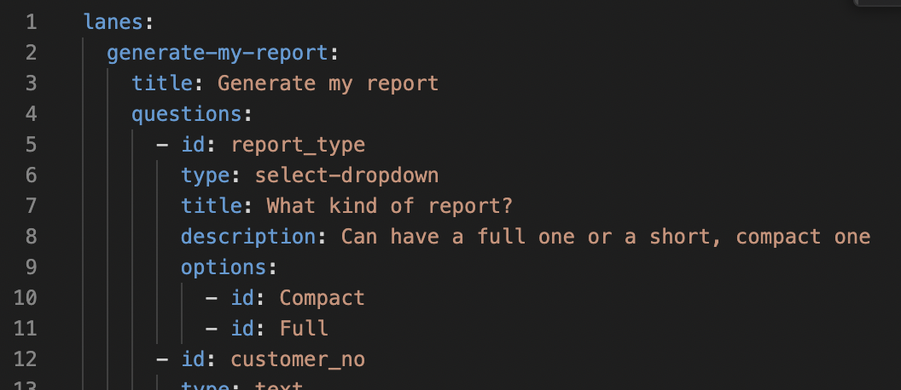
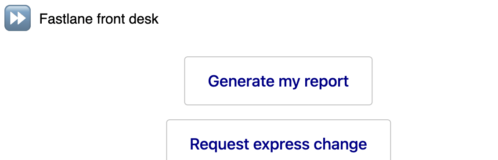
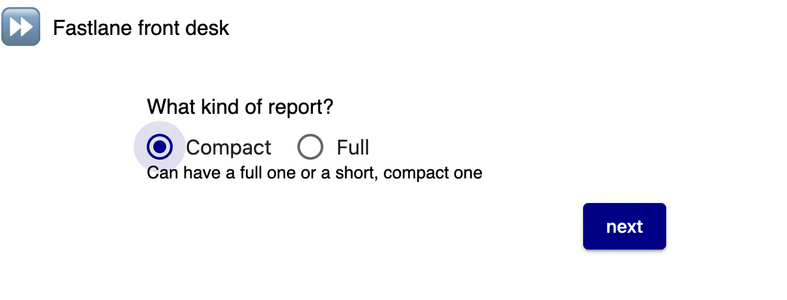
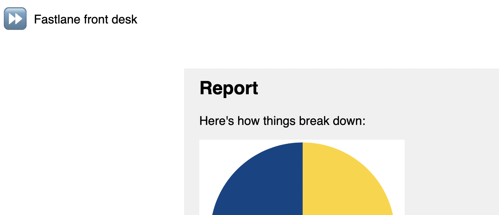
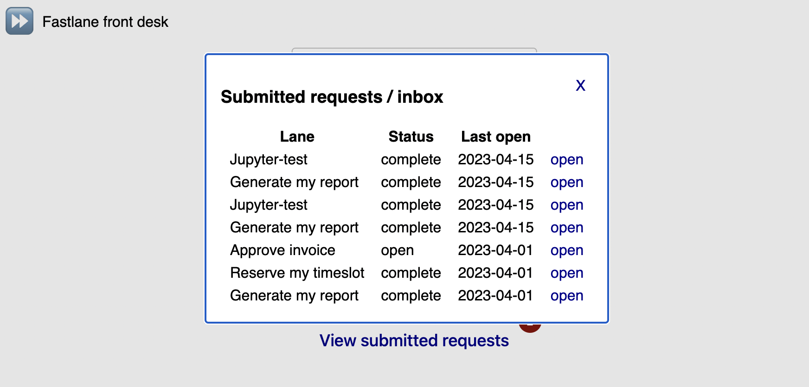

## Fastlane - front desk

Status: alpha

Offer stellar service to existing customers by offering a front desk / VIP area for your business or internal service. 

### What does it do?

- allows a while-labelled login
- catalog of services w/ nice UI
- directly give feedback
- & directly engage your customers
- transparently share delivery status
- pro-actively ask customers
- (to come) analytics on customer interactions 

### Defining services

Initial examples included: 

- Reserving a timeslot
- Requesting a custom report
- Requesting an express change
- a full Jupyter report generation

could also be a lot more, like

- find the right product / spare part
- check availability of upgrades (& book)
- check current balance / status
- reorder sth from custom catalog
- sign up (or out) of a service

Services are defined in `fastlane.yml` and created via `POST /api/createLaneFromDef?typeName=nameFromYaml&forUsers=email1@domain1,email2@domain2` - they consist of 

1. a set of questions (freeform, dropdown, etc.)
2. a backend (API, Lambda) to invoke
3. how to present the result

So, instead of creating a full app for this, all that's needed is 

1. a small API/Lambda
2. a definition in `fastlane.yml`

and y're good to go.

### Steps to get going

1. (as admin) Define lanes and users in fastlane.yml (it auto-updates after max 30s)  
2. (as user) Log in and choose a lane  
3. Answer the questions  
4. Submit and get immediate feedback from the configured backend  

New lanes can also be submitted via API, so you can request feedback. Users get an inbox of all open request (+ a list of completed):  

### Freestyle services

Pro-actively engage one or two people

- ask specific feedback
- just share a deliverable
- invite to an event
- ask to connect to a peer
- proactively share updates

(like asking for specific feedback or just sharing a document)

Use the API (`POST /api/createFreestyleLane?forUsers=email1@domain1,email2@domain2`) to submit a full definition. 

